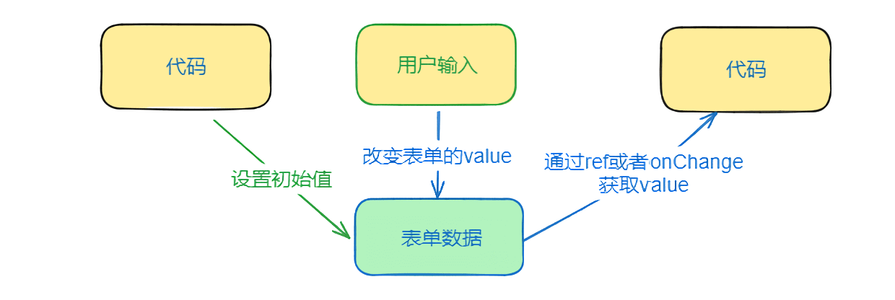
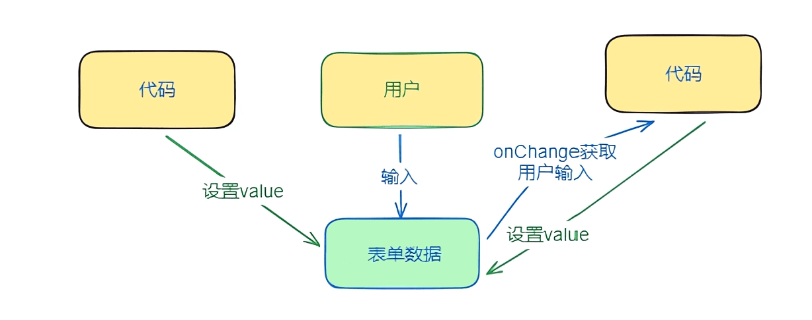

# 受控与非受控

以小见大，先通过表单元素，再去了解组件。

## 表单元素

在表单中，我们可以通过两种方式去改变表单的值 `value` ，一种是 `用户的输入` ，一种是通过 `代码` 内部去改变。

`value` 的初始值，可以由代码设置，但是只能通过 `用户的输入` 去改变，代码可以通过 ref 拿到 DOM 或者 onChange 获取 value，并做额外操作，这是 `非受控模式` 。

**非受控模式图解**

与之相反，`代码` 可以内部自己改变 `value` 的值，这就是 `受控模式` 。

**受控模式图解**

::: tip
`value` 和 `defaultValue` 是不一样的。 `defaultValue` 只是设置了初始值，不是改变 value。一旦设置了 value，用户的输入不会改变表单的值，但是会触发 onChange 事件，可以通过 onChange 去获得输入的值，然后通过代码去设置表单的值，这就是受控模式。

大部分情况下，非受控模式就可以了，我们只需要获得用户输入的值，不需要手动修改表单的值。

value 由用户控制就是非受控模式，由代码控制就是受控模式。
:::
