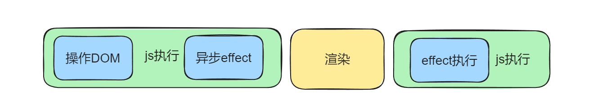
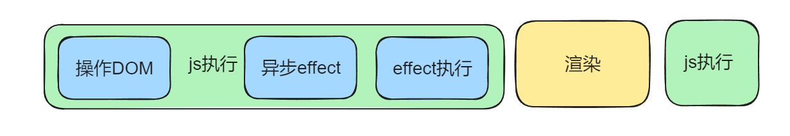

# React 中常见的 Hooks

## useState

`useState` 是用于在函数组件中添加 state 的 Hook。

```jsx
import React, { useState } from "react";

function Example() {
  const [count, setCount] = useState(0);

  return (
    <div>
      <p>You clicked {count} times</p>
      <button onClick={() => setCount(count + 1)}>Click me</button>
    </div>
  );
}
```

初始状态需要复杂计算得到的，可以使用函数来计算初始值:

```jsx
const [num, setNum] = useState(() => {
  const num1 = 1 + 2;
  const num2 = 2 + 3;
  return num1 + num2;
});
```

## useEffect

`useEffect` 用于处理副作用，如数据获取、订阅或手动修改 DOM

```jsx
useEffect(() => {
  // 执行副作用
  return () => {
    // 清理函数（可选）
  };
}, [dependencies]);
```

::: tip

- 当 dependencies 为空时，组件初始化的时候会执行一次回调函数。
- 当 dependencies 不为空时，回调函数会在依赖项变化时和初始化时执行。
  :::

当 useEffect 只有回调函数时，每次都会执行。

```jsx
useEffect(() => {
  // 执行副作用
  return () => {
    // 清理函数（可选）
  };
});
```

存在定时器时，记得使用 return 清除副作用，组件销毁的时候，也会执行 return 回调。

```jsx
import { useEffect, useState } from "react";

function App() {
  const [num, setNum] = useState(0);

  useEffect(() => {
    console.log("effect");
    const timer = setInterval(() => {
      console.log(num);
    }, 1000);

    return () => {
      console.log("clean up");
      clearInterval(timer);
    };
  }, [num]);

  return <div onClick={() => setNum((prevNum) => prevNum + 1)}>{num}</div>;
}

export default App;
```

## useLayoutEffect

useLayoutEffect 是 React 提供的一个 Hook，它的函数签名与 useEffect 相同，但它在所有 DOM 变更之后同步调用 effect。

```jsx
useLayoutEffect(effect, dependencies?)
```

### 执行时机

要理解 `useLayoutEffect`，我们需要先了解 React 的渲染过程：

1. React 更新虚拟 DOM 并计算出需要进行的 DOM 操作。
2. React 将这些操作应用到实际的 DOM。
3. 浏览器重新绘制屏幕。

`useLayoutEffect` 在步骤 2 之后，步骤 3 之前同步执行。相比之下，`useEffect` 是在步骤 3 之后异步执行的。

**useEffect图解**

**useLayoutEffect图解**


### 使用场景

`useLayoutEffect` 主要用于以下场景：

1. **需要在 DOM 更新后立即读取布局信息**：例如，需要获取元素的尺寸或位置。

2. **防止视觉闪烁**：当你需要根据 DOM 状态立即更新某些内容，使用 `useLayoutEffect` 可以避免用户看到中间状态。

3. **同步更新 DOM**：当你需要在浏览器绘制之前进行 DOM 操作时。

## useReducer
