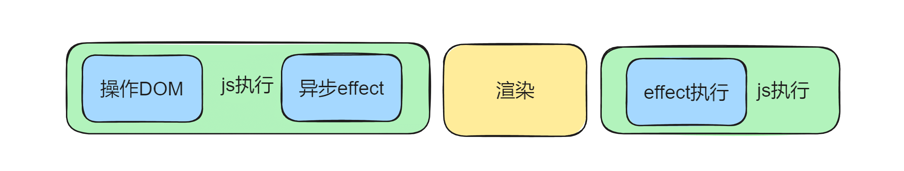
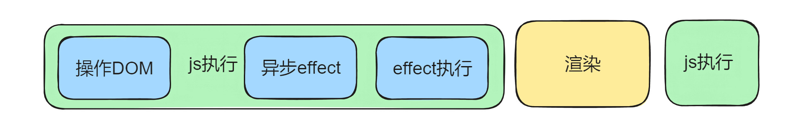

# React 中常见的 Hooks

## useState

`useState` 是用于在函数组件中添加 state 的 Hook。

```jsx
import React, { useState } from "react";

function Example() {
  const [count, setCount] = useState(0);

  return (
    <div>
      <p>You clicked {count} times</p>
      <button onClick={() => setCount(count + 1)}>Click me</button>
    </div>
  );
}
```

初始状态需要复杂计算得到的，可以使用函数来计算初始值:

```jsx
const [num, setNum] = useState(() => {
  const num1 = 1 + 2;
  const num2 = 2 + 3;
  return num1 + num2;
});
```

## useEffect

`useEffect` 用于处理副作用，如数据获取、订阅或手动修改 DOM

```jsx
useEffect(() => {
  // 执行副作用
  return () => {
    // 清理函数（可选）
  };
}, [dependencies]);
```

::: tip

- 当 dependencies 为空时，组件初始化的时候会执行一次回调函数。
- 当 dependencies 不为空时，回调函数会在依赖项变化时和初始化时执行。
  :::

当 useEffect 只有回调函数时，每次都会执行。

```jsx
useEffect(() => {
  // 执行副作用
  return () => {
    // 清理函数（可选）
  };
});
```

存在定时器时，记得使用 return 清除副作用，组件销毁的时候，会执行 return 回调。

```jsx
import { useEffect, useState } from "react";

function App() {
  const [num, setNum] = useState(0);

  useEffect(() => {
    console.log("effect");
    const timer = setInterval(() => {
      console.log(num);
    }, 1000);

    return () => {
      console.log("clean up");
      clearInterval(timer);
    };
  }, [num]);

  return <div onClick={() => setNum((prevNum) => prevNum + 1)}>{num}</div>;
}

export default App;
```

## useLayoutEffect

useLayoutEffect 是 React 提供的一个 Hook，它的函数签名与 useEffect 相同，但它在所有 DOM 变更之后同步调用 effect。

```jsx
useLayoutEffect(effect, dependencies?)
```

### 执行时机

要理解 `useLayoutEffect`，我们需要先了解 React 的渲染过程：

1. React 更新虚拟 DOM 并计算出需要进行的 DOM 操作。
2. React 将这些操作应用到实际的 DOM。
3. 浏览器重新绘制屏幕。

`useLayoutEffect` 在步骤 2 之后，步骤 3 之前同步执行。相比之下，`useEffect` 是在步骤 3 之后异步执行的。

**useEffect 图解**


**useLayoutEffect 图解**


### 使用场景

`useLayoutEffect` 主要用于以下场景：

1. **需要在 DOM 更新后立即读取布局信息**：例如，需要获取元素的尺寸或位置。

2. **防止视觉闪烁**：当你需要根据 DOM 状态立即更新某些内容，使用 `useLayoutEffect` 可以避免用户看到中间状态。

3. **同步更新 DOM**：当你需要在浏览器绘制之前进行 DOM 操作时。

## useReducer

`useReducer` 用于管理复杂的状态逻辑，可以在修改值的时候，执行一些固定逻辑

```tsx
import { Reducer, useReducer } from "react";

interface Data {
  result: number;
}

interface Action {
  type: "add" | "minus";
  num: number;
}
function reducer(state: Data, action: Action) {
  switch (action.type) {
    case "add":
      return {
        result: state.result + action.num,
      };
    case "minus":
      return {
        result: state.result - action.num,
      };
  }
  return state;
}

function App() {
  const [res, dispatch] = useReducer<Reducer<Data, Action>>(reducer, {
    result: 0,
  });

  return (
    <div>
      <div onClick={() => dispatch({ type: "add", num: 2 })}>加</div>
      <div onClick={() => dispatch({ type: "minus", num: 1 })}>减</div>
      <div>{res.result}</div>
    </div>
  );
}

export default App;
```

::: tip
在 reducer 中，直接修改 state 的值是不会触发重新渲染的，必须返回一个新的对象。

建议搭配 immer 使用，produce 是唯一的 API，第一个参数是要修改的对象，第二个参数的函数里直接修改这个对象的属性，返回的结果就是一个新的对象。

```js
return produce(state, (state) => {
  state.a.c.e += action.num;
});
```

在 react 里，只要涉及到 state 的修改，就必须返回新的对象，不管是 useState 还是 useReducer。
:::

## useRef

`useRef` 用于保存可变值，不会触发组件重新渲染,常用于保存 DOM 引用,可以用来存储任何可变值。

```tsx
import { useEffect, useRef } from "react";

function App() {
  const inputRef = useRef<HTMLInputElement>(null);

  useEffect(() => {
    inputRef.current?.focus();
  });

  return (
    <div>
      <input ref={inputRef}></input>
    </div>
  );
}

export default App;
```

### ref 从子组件传到父组件

```tsx
import { useRef } from "react";
import { useEffect } from "react";
import React from "react";

const Son: React.ForwardRefRenderFunction<HTMLInputElement> = (props, ref) => {
  return (
    <div>
      <input ref={ref}></input>
    </div>
  );
};

const Father = React.forwardRef(Son);

function App() {
  const ref = useRef<HTMLInputElement>(null);

  useEffect(() => {
    console.log("ref", ref.current);
    ref.current?.focus();
  }, []);

  return (
    <div className="App">
      <Father ref={ref} />
    </div>
  );
}

export default App;
```

### **useImperativeHandle**

暴露自定义内容。它有 3 个参数，第一个是传入的 ref，第二个是是返回新的 ref 值的函数，第三个是依赖数组

```tsx
import { useRef } from "react";
import { useEffect } from "react";
import React from "react";
import { useImperativeHandle } from "react";

interface RefProps {
  aaa: () => void;
}

const Guang: React.ForwardRefRenderFunction<RefProps> = (props, ref) => {
  const inputRef = useRef<HTMLInputElement>(null);

  useImperativeHandle(
    ref,
    () => {
      return {
        aaa() {
          inputRef.current?.focus();
        },
      };
    },
    [inputRef]
  );

  return (
    <div>
      <input ref={inputRef}></input>
    </div>
  );
};

const WrapedGuang = React.forwardRef(Guang);

function App() {
  const ref = useRef<RefProps>(null);

  useEffect(() => {
    console.log("ref", ref.current);
    ref.current?.aaa();
  }, []);

  return (
    <div className="App">
      <WrapedGuang ref={ref} />
    </div>
  );
}

export default App;
```

## useContent

跨任意层组件传递数据，我们一般用 Context

```tsx
import { createContext, useContext } from "react";

const countContext = createContext(111);

function Aaa() {
  return (
    <div>
      <countContext.Provider value={222}>
        <Bbb></Bbb>
      </countContext.Provider>
    </div>
  );
}

function Bbb() {
  return (
    <div>
      <Ccc></Ccc>
    </div>
  );
}

function Ccc() {
  const count = useContext(countContext);
  return <h2>context 的值为：{count}</h2>;
}

export default Aaa;
```

## memo

`memo` 是一个高阶组件，用于性能优化。它通过浅比较来判断组件的 props 是否变化，只有在 props 变化时才会重新渲染组件。

```tsx
import React, { memo } from "react";

const ChildComponent = memo(({ name }: { name: string }) => {
  console.log("Child component rendered");
  return <div>Hello, {name}</div>;
});

function App() {
  const [count, setCount] = React.useState(0);

  return (
    <div>
      <ChildComponent name="React" />
      <button onClick={() => setCount(count + 1)}>Increase Count</button>
      <p>Count: {count}</p>
    </div>
  );
}

export default App;
```

在这个示例中，ChildComponent 只有在 name prop 改变时才会重新渲染。

## useMemo

`useMemo` 用于缓存计算结果。它只有在依赖项变化时才会重新计算值，以优化性能。

```tsx
import React, { useMemo, useState } from "react";

function App() {
  const [count, setCount] = useState(0);
  const [text, setText] = useState("");

  const expensiveCalculation = (num: number) => {
    console.log("Calculating...");
    return num * 2;
  };

  const memoizedValue = useMemo(() => expensiveCalculation(count), [count]);

  return (
    <div>
      <p>Count: {count}</p>
      <button onClick={() => setCount(count + 1)}>Increase Count</button>
      <p>Expensive Calculation Result: {memoizedValue}</p>
      <input
        type="text"
        value={text}
        onChange={(e) => setText(e.target.value)}
      />
    </div>
  );
}

export default App;
```

在这个示例中，`expensiveCalculation` 只有在 `count` 变化时才会重新计算。

## useCallback

`useCallback` 用于缓存函数定义。它只有在依赖项变化时才会重新创建函数，以避免不必要的重新渲染。

```tsx
import React, { useState, useCallback } from "react";

const ChildComponent = React.memo(({ onClick }: { onClick: () => void }) => {
  console.log("Child component rendered");
  return <button onClick={onClick}>Click me</button>;
});

function App() {
  const [count, setCount] = useState(0);
  const [text, setText] = useState("");

  const handleClick = useCallback(() => {
    setCount((prevCount) => prevCount + 1);
  }, []);

  return (
    <div>
      <p>Count: {count}</p>
      <ChildComponent onClick={handleClick} />
      <input
        type="text"
        value={text}
        onChange={(e) => setText(e.target.value)}
      />
    </div>
  );
}

export default App;
```

在这个示例中，`handleClick` 函数只有在依赖项变化时（在这个例子中没有依赖项，所以它永远不会变化）才会重新创建。

通过使用 `memo`、`useMemo` 和 `useCallback`，你可以在 React 应用中显著提升性能，特别是在处理大量数据或频繁渲染时。
